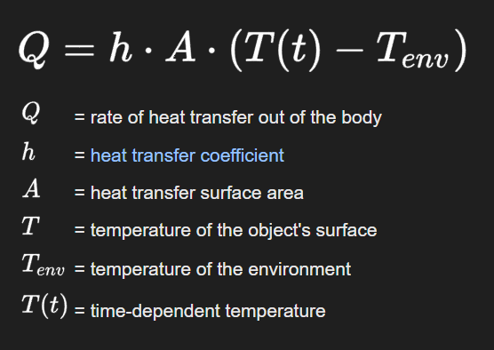
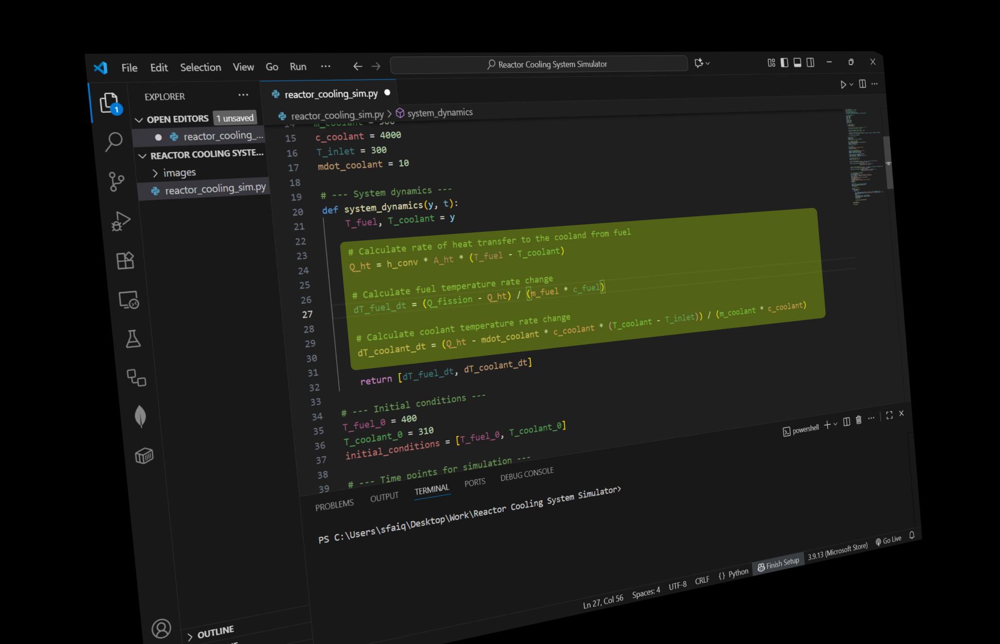
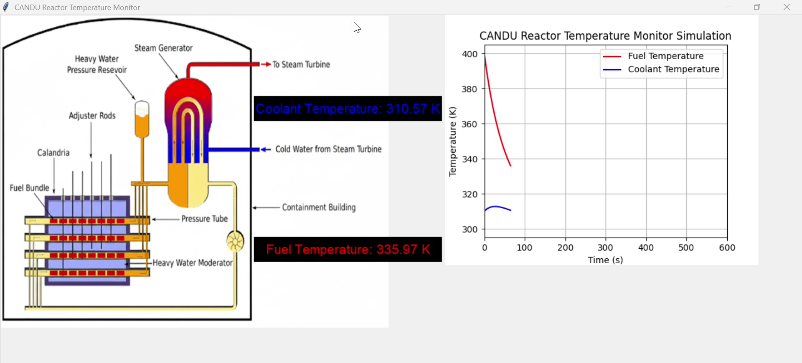

# Documentation: CANDU Reactor Temperature Monitor Simulator

## Introduction

Nuclear energy is one of the most powerful and fascinating technologies humans have ever developed. At the heart of this technology lies the **reactor core**, where the splitting of uranium atoms releases an immense amount of energy in the form of **heat**.

Canada is home to one of the most innovative nuclear reactor designs in the world: the **CANDU reactor** (CANada Deuterium Uranium). Unlike most reactors, the CANDU uses **natural uranium** as fuel and **heavy water (deuterium oxide)** as both moderator and coolant. This makes it highly efficient, flexible, and a cornerstone of clean electricity generation in Canada.

Imagine standing before this engineering marvel — **a machine that controls the raw power of atomic fission** and turns it into clean, reliable electricity for millions of homes.

Our program brings a small piece of that excitement to life. While not a full reactor simulation, it models **heat transfer** inside a nuclear system, showing how **fuel temperature** and **coolant temperature** evolve over time. Even better, it visualizes the process through a live graph and a graphical user interface (GUI), giving you a window into the invisible but critical thermal dance happening inside a reactor.

## What This Project Does

This simulator models the heat exchange between the **nuclear fuel** and the **coolant** inside a CANDU reactor over time. It calculates how temperatures in both systems change second by second, starting from defined initial conditions, and displays those changes live, the same way a real control room operator would monitor reactor thermal behaviour.

The simulation runs for a 3,600 second (one hour) operational window and updates the dashboard in real time.

## The Physics Behind It

The simulation is grounded in **Newton's Law of Cooling**, which describes the rate at which heat transfers from a hotter body to a cooler one:



In simple terms: the hotter the fuel is compared to the coolant, the faster heat moves between them. As they get closer in temperature, the transfer slows down. This is the same principle that explains why a hot cup of coffee cools quickly at first and then more slowly as it approaches room temperature.

Where:
- **Q** = rate of heat transfer out of the body
- **h** = heat transfer coefficient
- **A** = heat transfer surface area
- **T(t)** = time dependent temperature of the object's surface
- **T_env** = temperature of the surrounding environment

This formula is applied to model heat flowing from the fuel rods into the coolant, and then from the coolant out through the steam generator loop.

## How the Code Works

The core of the simulation is the `system_dynamics()` function, which computes two coupled differential equations, one for fuel temperature and one for coolant temperature, at every time step:



These equations are solved numerically using `scipy.integrate.odeint`, which steps through time and calculates the temperature of both systems at each point. The key physical relationships modelled are:

- **Fuel temperature** drops as heat transfers to the coolant
- **Coolant temperature** rises as it absorbs heat from the fuel, then stabilizes as it circulates through the cooling loop back toward the inlet temperature

## The Dashboard

The GUI is built with **Tkinter** and **Matplotlib**, and shows two things side by side:

- A labelled CANDU reactor diagram (left) with live fuel and coolant temperature readings overlaid
- A real time temperature plot (right) tracking both temperatures over the simulation window

### At startup: initial conditions

The simulation begins with the fuel at **400 K** and the coolant at **310 K**. You can see the fuel temperature beginning its rapid descent as the coolant absorbs heat:


### After approximately one minute of simulated time

The fuel has cooled significantly toward thermal equilibrium while the coolant temperature rises slightly and begins to stabilize as the cooling loop compensates:



## Tech Stack

| Tool | Purpose |
|------|---------|
| Python 3 | Core language |
| NumPy | Time array and numerical operations |
| SciPy (`odeint`) | Solving the coupled differential equations |
| Matplotlib | Real time temperature plot |
| Tkinter | GUI window and dashboard layout |
| Pillow (PIL) | Loading and displaying the reactor background image |

## How to Run

**1. Clone the repository**
```bash
git clone https://github.com/faaiqshaikh/CANDU-reactor-temperature-monitor-simulator.git
cd CANDU-reactor-temperature-monitor-simulator
```

**2. Install dependencies**
```bash
pip install numpy scipy matplotlib pillow
```

**3. Run the simulator**
```bash
python reactor_cooling_sim.py
```

The dashboard window will open and begin updating automatically.

## Why This is Exciting

This program gives you a **front-row seat** to the inner workings of a nuclear reactor safely, on your computer screen!

While real reactors involve extremely complex physics and safety systems, this simplified model captures the **essence of reactor cooling**: fuel gets hot, coolant takes the heat away, and stability is achieved through balance.

If you’ve ever wondered *“what does a reactor actually do?”*, this program makes that invisible process visible.


## Author

**Mohammedfaiq Shaikh**
[github.com/mohammedfaiqshaikh](https://github.com/mohammedfaiqshaikh)
